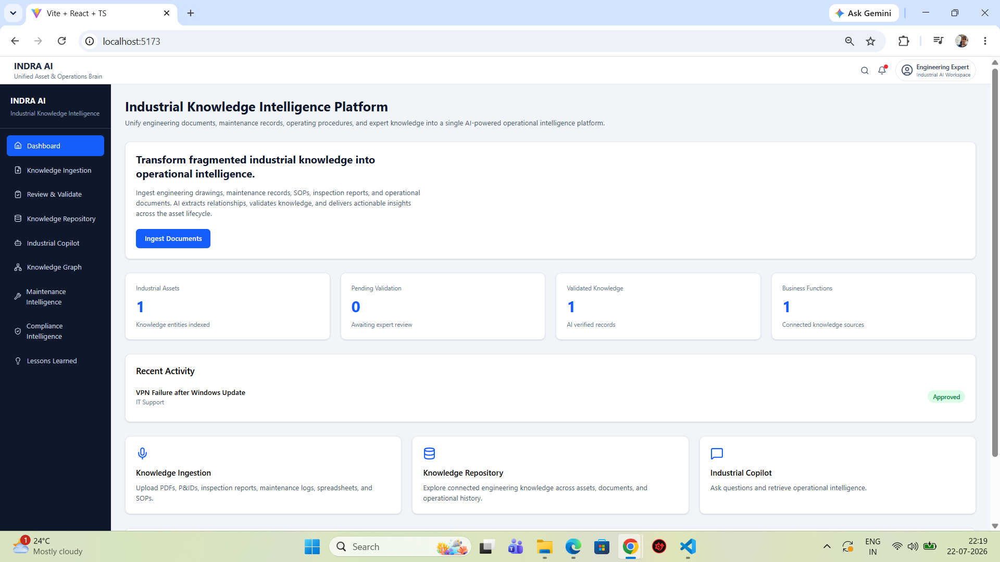
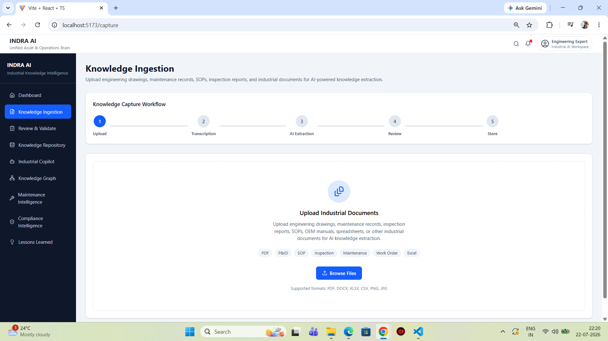
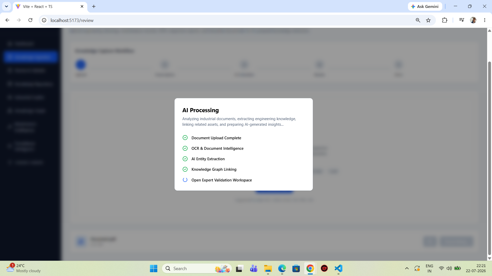
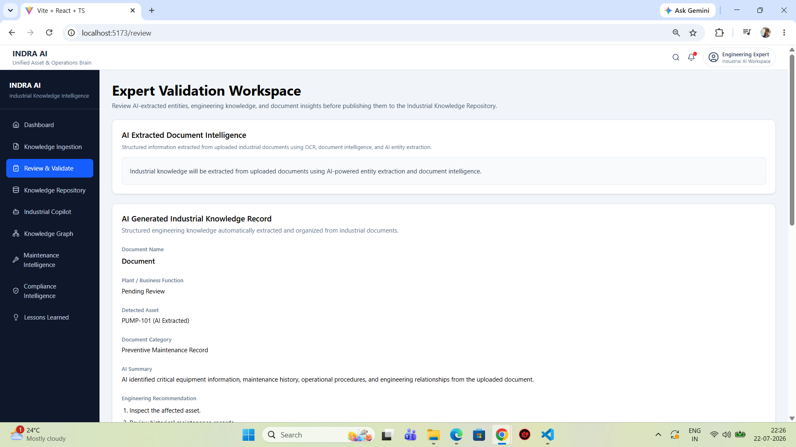
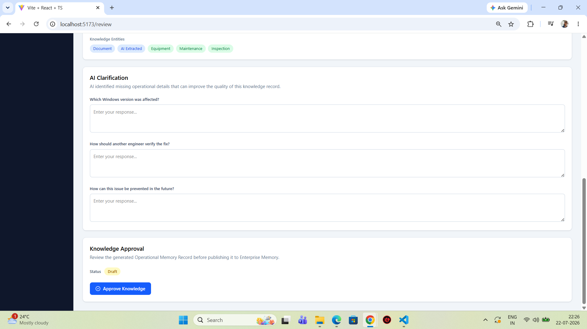
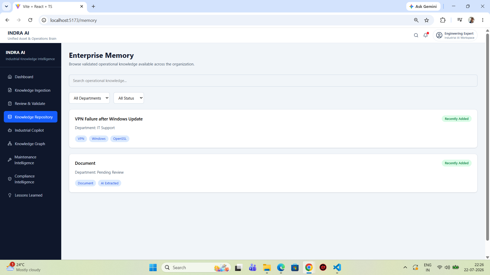
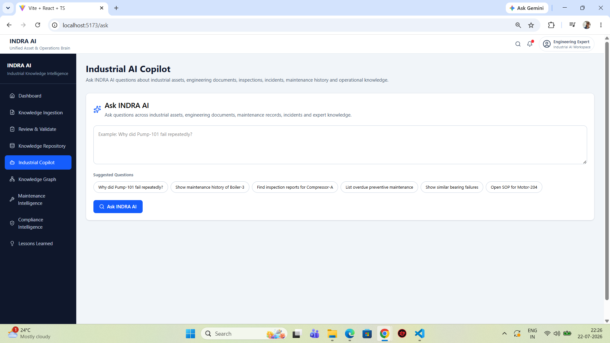
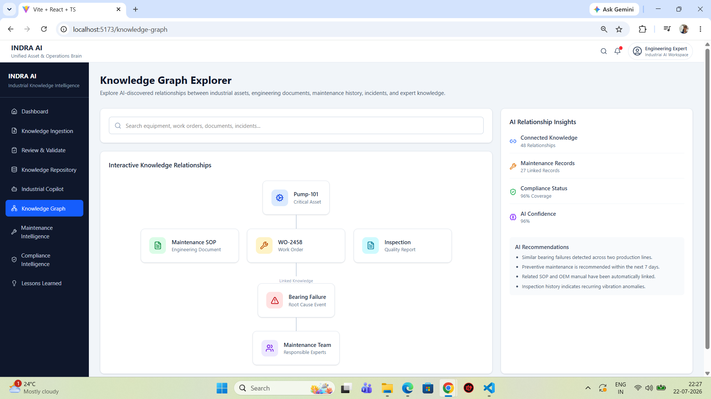

# 🚀 INDRA AI
### Unified Asset & Operations Brain

> **Transforming Industrial Documents into Actionable Operational Intelligence**

---

## 🏆 ET AI Hackathon 2.0 Submission

**Team Name:** Hallucinati

**Team Member:** Ansh Shrivastava

---

## 📌 Problem Statement

Industrial enterprises generate massive volumes of engineering knowledge in the form of:

- Standard Operating Procedures (SOPs)
- Maintenance Logs
- Inspection Reports
- OEM Manuals
- Work Orders
- Failure Analysis Reports

Unfortunately, this knowledge remains fragmented across multiple systems and documents, making it difficult for engineers to quickly retrieve critical operational insights.

---

# 💡 Solution

**INDRA AI** is an AI-powered Industrial Knowledge Intelligence Platform that transforms unstructured engineering documents into an interconnected knowledge ecosystem.

Using AI-driven extraction, expert validation, knowledge graph construction, and an Industrial AI Copilot, INDRA AI enables engineers to retrieve contextual knowledge, understand asset relationships, and make faster operational decisions.

---

# ✨ Key Features

## 📄 AI-Powered Knowledge Ingestion

- Upload industrial documents
- Support for multiple engineering document formats
- AI-assisted information extraction

---

## 🧠 Intelligent Knowledge Extraction

Automatically identifies:

- Assets
- Equipment
- Engineering entities
- Failure events
- Maintenance activities
- Operational recommendations

---

## ✅ Expert Validation

Human-in-the-loop workflow for validating AI-generated knowledge before publishing it into the enterprise repository.

---

## 📚 Industrial Knowledge Repository

Centralized repository supporting:

- Search
- Filtering
- Engineering knowledge lookup
- Asset-centric organization

---

## 🕸 Knowledge Graph

Visualizes relationships between:

- Assets
- SOPs
- Work Orders
- Inspection Reports
- Failure Events
- Engineering Teams

---

## 🤖 Industrial AI Copilot

Natural language assistant capable of answering engineering questions such as:

- Why did Pump-101 fail repeatedly?
- Show maintenance history of Boiler-3.
- Find inspection reports for Compressor-A.
- Show similar bearing failures.

---

# 🏗 System Workflow

```
Engineering Documents
        │
        ▼
Knowledge Ingestion
        │
        ▼
AI Extraction
        │
        ▼
Expert Validation
        │
        ▼
Knowledge Repository
        │
        ▼
Knowledge Graph
        │
        ▼
Industrial AI Copilot
```

---

# 🛠 Technology Stack

### Frontend

- React
- TypeScript
- Vite
- Tailwind CSS

### UI

- shadcn/ui
- Lucide Icons

### AI Concepts Demonstrated

- Document Intelligence
- Knowledge Extraction
- Knowledge Graph
- Human-in-the-loop Validation
- AI Copilot
- Semantic Knowledge Retrieval

---

# 📸 Application Screenshots

## Dashboard



---

## Knowledge Ingestion



---

## AI Processing Pipeline



---

## Expert Validation Workspace

### AI Extracted Knowledge



### Expert Review & Validation



---

## Knowledge Repository



---

## Knowledge Graph



---

## Industrial AI Copilot



---

# 🚀 Getting Started

Clone the repository

```bash
git clone https://github.com/TrueMenace/INDRA-AI.git
```

Install dependencies

```bash
npm install
```

Run locally

```bash
npm run dev
```

---

# 🔮 Future Scope

- Enterprise Authentication
- Vector Database Integration
- Retrieval-Augmented Generation (RAG)
- LLM-powered Root Cause Analysis
- Predictive Maintenance Insights
- SAP / Maximo Integration
- Multi-Plant Knowledge Sharing
- Real-time Industrial AI Assistant

---

# 🎯 Impact

INDRA AI enables organizations to:

- Preserve institutional knowledge
- Reduce engineering search time
- Accelerate troubleshooting
- Improve maintenance planning
- Connect fragmented engineering documents
- Support AI-assisted operational decision-making

---

# 👨‍💻 Developed By

**Ansh Shrivastava**

Team **Hallucinati**

ET AI Hackathon 2.0

---

## ⭐ If you found this project interesting, consider giving it a star!